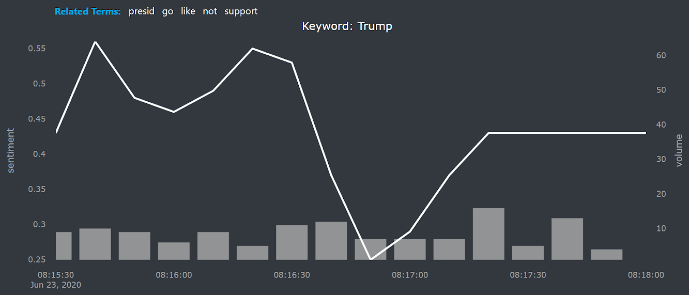

# Twitter Sentiment Dashboard
This tool is for collecting and analyzing tweets using a self-trained LSTM model, giving you a quick view about how others react to the topic you are into.
We're still looking for a way to deploy the app on a server, before that's finished you'll have to clone the repo and run the code on your computer.

## Feaures
### Live Sentiment on Twitter
By utilizing the [Tweepy Streaming API](http://docs.tweepy.org/en/latest/streaming_how_to.html), the [api.py](api.py) file collects tweets real-time and store them in a sqlite database. After the database is constructed locally, the app will be accessible by running the [app.py](app.py) file and going to this link: [http://127.0.0.1:8050/](http://127.0.0.1:8050/).

### Analyze the Tweets


### Test Out the Model
<p align="center">
  
  
</p>
 
## Requirements
- Keras 2.3.1
- tensorflow 2.2.0
- dash_core_components 1.10.0
- nltk 3.4.5
- wordcloud 1.7.0
- dash_html_components 1.0.3
- numpy 1.17.0
- dash 1.12.0
- requests 2.23.0
- Unidecode 1.1.1
- pandas 1.0.3
- plotly 4.8.1
- tweepy 3.8.0
- dash_table 4.7.0
- dash_bootstrap_components 0.10.2
- Pillow 7.1.2
- scikit_learn 0.23.1

### NLTK Package Requirements
Once you download the files to your computer, you needn't do it again.
 
 ```python
import nltk
nltk.download('stopwords') 
nltk.download('punkt') 
```
